---

# OOP Enrollment System

---

**Author**: Mika Madrigal

**1. Description**: Encapsulation

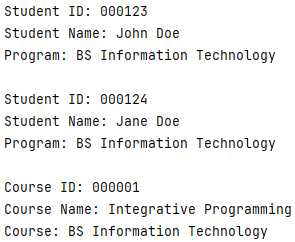
**1. Description**: Inheritance

**Person Class**
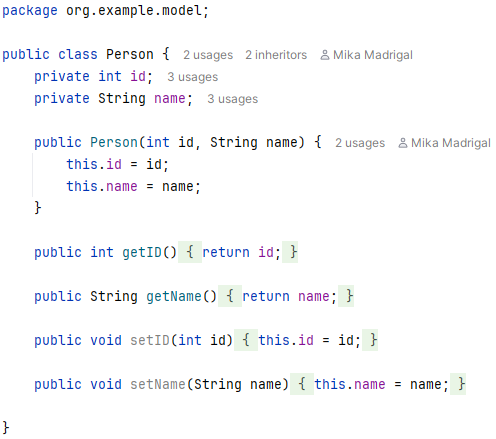

**Student Class**
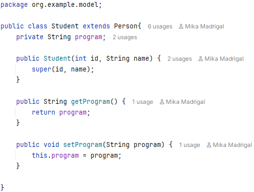

**Instructor Class**
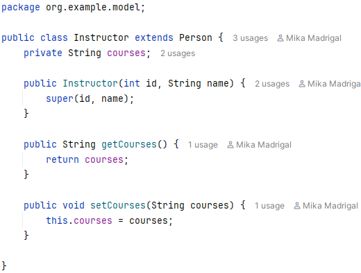

**Main Class**
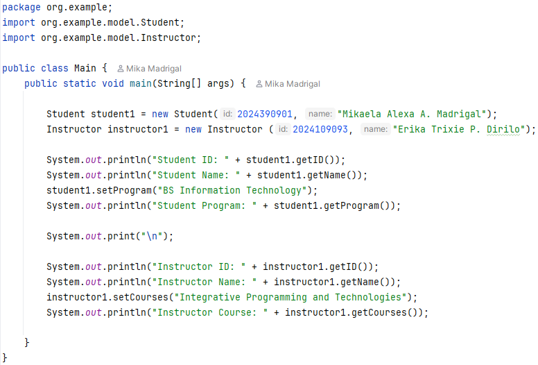

**Output**
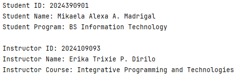

---

**2. Description: Abstraction**

**Person Class**
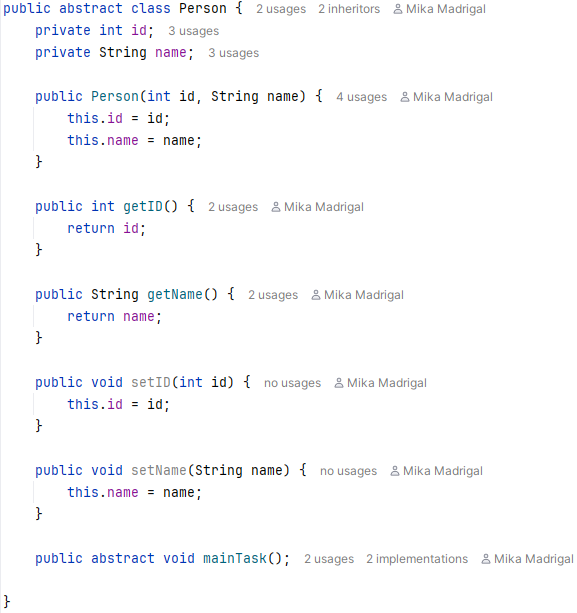

**Student Class**
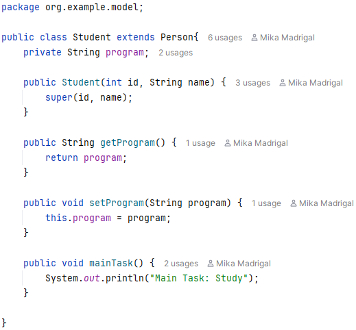

**Instructor Class**
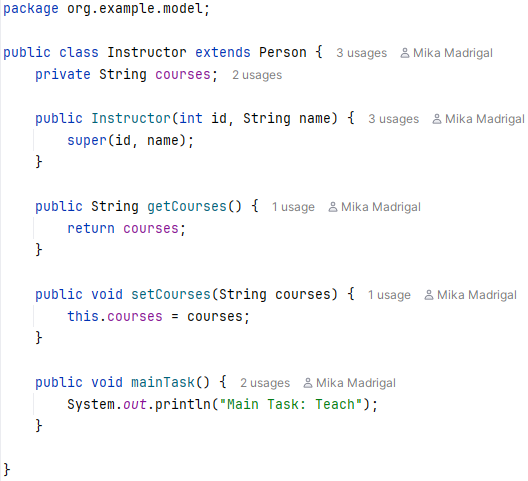

**Main Class**
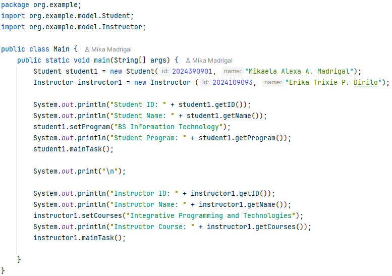

**Output**
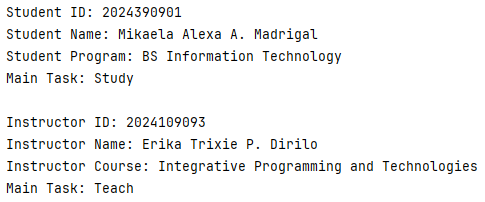
